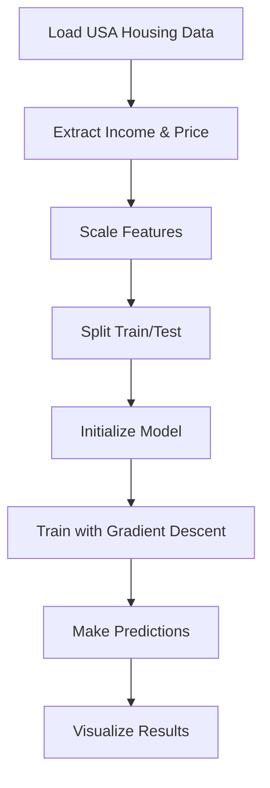

# Linear Regression from Scratch

## Project Overview

This project implements a **Linear Regression model from scratch** using gradient descent optimization to predict house prices based on average area income.

## What I am  Doing

### 1. Custom Linear Regression Implementation
- Built a complete linear regression class without using sklearn's LinearRegression
- Uses **gradient descent** to find optimal weights and bias
- Implements the mathematical foundation of linear regression

### 2. Data Processing
- Loading USA Housing dataset
- Using **Average Area Income** as the feature to predict **House Price**
- Feature scaling for better model performance

### 3. Model Training & Visualization
- Training the model on scaled data
- Making predictions on test data
- Visualizing results with actual vs predicted prices

## Mathematical Foundation

### Linear Regression Formula
```
y = wx + b
```
Where:
- `y` = predicted house price
- `w` = weight (slope)
- `x` = average area income
- `b` = bias (intercept)

### Gradient Descent Update Rules
```
w = w - α * (∂J/∂w)
b = b - α * (∂J/∂b)
```
Where:
- `α` = learning rate (0.01)
- `J` = cost function (Mean Squared Error)

## Project Structure
```
project/
├── main.py                    
├── images/
│   └── regression_plot.png   
├── linear_regression/
│   ├── __init__.py           
│   └── LinearRegression.py  
└── dataset/
    └── USA_Housing.csv       # Housing data
```

## Key Features

### Feature Scaling
```python
scaler = StandardScaler()
X_scaled = scaler.fit_transform(X)
```
**Why needed?** Income values are large (50K-200K), making gradient descent unstable.

**Before scaling:** Required learning_rate=0.00000001, iterations=100,000
**After scaling:** Uses learning_rate=0.01, iterations=1,000

### Gradient Descent Process
1. **Initialize** weights and bias to zero
2. **Forward pass:** Calculate predictions
3. **Calculate gradients:** Find direction to minimize error
4. **Update parameters:** Move in opposite direction of gradients
5. **Repeat** for specified iterations

## Algorithm Flow



## Results Visualization


The final plot shows:
- **Blue dots:** Actual house prices from test data
- **Red line:** Predicted prices from our custom model
- **X-axis:** Average Area Income (original scale)
- **Y-axis:** House Price

## Learning Outcomes

1. **Understanding gradient descent** optimization from scratch
2. **Importance of feature scaling** in machine learning
3. **Linear relationship** between income and house prices
4. **Difference between training and testing** phases
5. **Data preprocessing** techniques

## Performance Considerations

- **Convergence:** Model converges in 1,000 iterations with proper scaling
- **Accuracy:** Linear model captures general trend in housing prices
- **Efficiency:** Custom implementation is educational but slower than optimized libraries

## Next Steps

- Add multiple features (bedrooms, area, etc.)
- Implement regularization techniques
- Compare with sklearn's LinearRegression
- Add model evaluation metrics (MSE, R²)